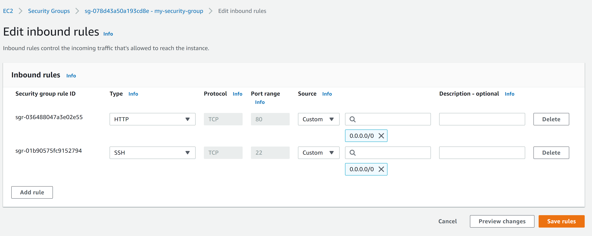

# Project 2 - LEMP Stack Implementation
---


## Step 1 - Install NGINX Web Server

### Update EC2 instance and install NGINX 
- Update instance:
    ```
    sudo apt update
    ```
- Install NGINX:
    ```
    sudo apt install nginx
    ```
- Verify installation by checking status:
    ```
    sudo systemctl status nginx
    ```
    


### Open Server's Port 80 in AWS Console for http access
- Go to security group attached to EC2 instance.
- Edit inbound rules
- Add connection type of `http` to rule and make it accessible from any ip4 Address.

- Check that it works in terminal:
    ```
    curl http://localhost:80
    ```
    
- Check with browser using server's Public DNS: `ec2-52-87-205-98.compute-1.amazonaws.com` OR using Public IP Address: `52.87.205.98`


---


## Step 2 - MySQL

### Install MySQL server software in EC2 instance via terminal
- Install MySQL Server Software: 
    ```
    sudo apt install mysql-server
    ```
- Login to MySQL: 
    ```
    sudo mysql
    ```
    


### Secure MySQL root account with password
- Set root user password: 
    ```
    ALTER USER 'root'@'localhost' IDENTIFIED WITH mysql_native_password BY 'DeFPassyWord_1';
    ```
    
- Exit MySQL Shell: 
    ```
    exit
    ```

### Remove insecure default setting with pre-installed security script
- Start script: 
    ```
    sudo mysql_secure_installation
    ```
- Follow and respond to prompts to setup according to preference.

- Login with `-p` flag to prompt for password and verify everything works well.
    ```
    sudo mysql -p
    ```
    
- Exit MySQL Shell: 
    ```
    exit
    ``` 

---


## Step 3 - PHP


### Install PHP and required dependencies for communicating with MySQL & NGINX
- Install `php-fpm` to process PHP requests to Nginx and `php-mysql` to communicate with MySQL Databases, all with one command: 
    ```
    sudo apt install php-fpm php-mysql
    ```
- Confirm PHP installation with: 
    ```
    php -v
    ```
    


---


## Step 4 - Configure Nginx to use PHP Processor

### Setup Website Domain & Server Block
- Create root directory for new website:
    ```
    sudo mkdir /var/www/mylemp
    ```
- Assign ownership of directory to current user:
    ```
    sudo chown -R $USER:$USER /var/www/mylemp
    ```
- Create & edit new configuration file in `sites-available` directory:
    ```
    sudo nano /etc/nginx/sites-available/mylemp
    ```
- Enter the following configuration code:
    ```
    # /etc/nginx/sites-available/mylemp

    server {
        listen 80;
        server_name mylemp www.mylemp;
        root /var/www/mylemp;

        index index.html index.htm index.php;

        location / {
            try_files $uri $uri/ =404;
        }

        location ~ \.php$ {
            include snippets/fastcgi-php.conf;
            fastcgi_pass unix:/var/run/php/php8.1-fpm.sock;
        }

        location ~ /\.ht {
            deny all;
        }
    }
    ```
- Exit editing mode with `CTRL/CMD + X`, then `Y`, then `ENTER`.
- Link configuration file to `sites-enabled` directory to activate:
    ```
    sudo ln -s /etc/nginx/sites-available/mylemp /etc/nginx/sites-enabled/
    ```
- Test for syntax errors;
    ```
    sudo nginx -t
    ```
    
- Disable default Nginx website & server block currently configured to also listen on port 80:
    ```
    sudo unlink /etc/nginx/sites-enabled/default
    ```
- Reload Nginx to apply changes:
    ```
    sudo systemctl reload nginx
    ```
- Create `index.html` in `/var/www/mylemp`:
    ```
    sudo echo 'Hello LEMP from hostname' $(curl -s http://169.254.169.254/latest/meta-data/public-hostname) 'with public IP' $(curl -s http://169.254.169.254/latest/meta-data/public-ipv4) > /var/www/mylemp/index.html
    ```
- Check with browser using server's Public DNS: `ec2-52-87-205-98.compute-1.amazonaws.com` OR using Public IP Address: `52.87.205.98`


---


## Step 5 - Testing PHP with NGINX

### Create & edit with PHP File
- Create `.php` file in website's root directory:
    ```
    sudo nano /var/www/mylemp/info.php
    ```
- Insert PHP code:
    ```
    <?php
        phpinfo();
    ?>
    ```
- Check with browser using server's Public DNS: `ec2-52-87-205-98.compute-1.amazonaws.com/info.php` OR using Public IP Address: `52.87.205.98/info.php`

- Remove PHP info file:
    ```
    sudo rm /var/www/mylemp/info.php
    ```


---


## Step 6 - Retrieve Data from MySQL Database with PHP

### Create new MySQL user, database, and insert data
- Connect to MySQL:
    ```
    sudo mysql
    ```
- Create new database:
    ```
    CREATE DATABASE `lemp_db`;
    ```
    
- Create new MySQL user:
    ```
    CREATE USER 'lemp_user'@'%' IDENTIFIED WITH mysql_native_password BY 'lemp_pass';
    ```
    
- Give the new user `lemp_user` permission over `lemp-db`:
    ```
    GRANT ALL ON lemp_db.* TO 'lemp_user'@'%';
    ```
    
- Exit MySQL console as root:
    ```
    exit
    ```
- Log back into MySQL console as new user `lemp_user` with password:
    ```
    mysql -u lemp_user -p
    ```
- Verify user has permission over database `lemp_db`:
    ```
    SHOW DATABASES;
    ```
    
- Select database:
    ```
    USE lemp_db
    ```
- Create table named `to_list`:
    ```
    CREATE TABLE todo_list (
        item_id INT AUTO_INCREMENT,
        content VARCHAR(255),
        PRIMARY KEY(item_id)
    );
    ```
    
- Increate data into table rows:
    ```
    INSERT INTO todo_list (content)
    VALUES 
        ("Item One"),
        ("Item Two"),
        ("Item Three"),
        ("Item Four"),
        ("Item Five"),
        ("Item Six"),
        ("Item Seven");
- View data in `todo-list` table:
    ```
    SELECT * FROM todo_list;
    ```
    
- Exit MySQL Console:
    ```
    exit
    ```

### Create PHP file & retrieve data
- Create & edit `.php` file in website's root directory `mylemp`:
    ```
    nano /var/www/mylemp/todo.php
    ```
- Insert the following PHP code into file:
    ```
    <?php 
        $user = "lemp_user";
        $password = "lemp_pass";
        $database = "lemp_db";
        $table = "todo_list";

        try {
            $db = new PDO("mysql:host=localhost;dbname=$database", $user, $password);
            echo "<h2>TODO</h2><ol>";
            foreach($db->query("SELECT content FROM $table") as $row) {
                echo "<li>" . $row['content'] . "</li>";
            }
            echo "</ol>";
        } catch (PDOException $e) {
            print "Error!: " . $e->getMessage() . "<br/>";
            die();
        }
    ?>
    ```
- Check with browser using server's Public DNS: `ec2-52-87-205-98.compute-1.amazonaws.com/todo.php` OR using Public IP Address: `52.87.205.98/todo.php`


---
